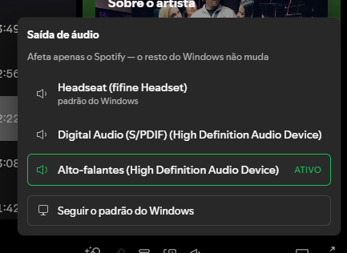
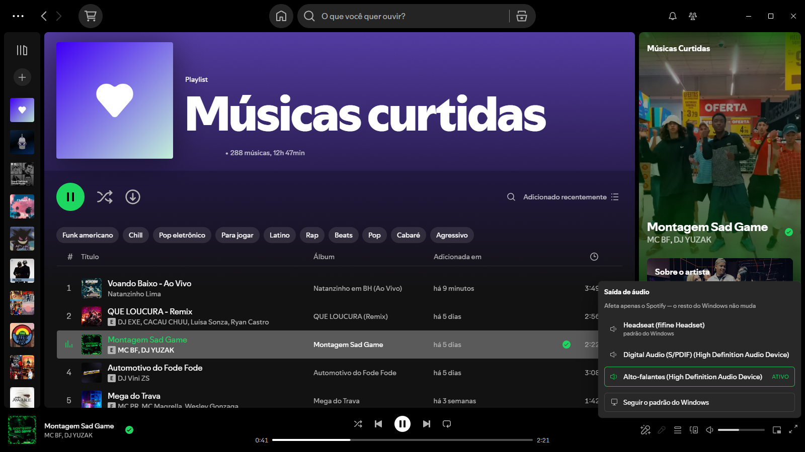

# audio-config

Extensão [Spicetify](https://spicetify.app/) que troca a **saída de áudio do Spotify** sem sair do player. Clique com o botão direito no controle de volume e escolha o dispositivo.

<p align="center">
  
</p>

A troca vale **só para o Spotify**. O dispositivo padrão do Windows continua onde está, e os outros aplicativos não são afetados — dá para mandar a música para a caixa de som enquanto a chamada continua no headset.

Não há instalação extra, processo em segundo plano ou dependência. É só o arquivo `.js`.

## Como usar

Clique com o **botão direito no controle de volume** da barra do player — funciona no ícone e na barrinha:

<p align="center">
  
</p>

O popup abre logo acima do controle e lista os dispositivos de saída disponíveis:

- O dispositivo em uso pelo Spotify aparece com **anel verde** e o selo **ATIVO**.
- O padrão do Windows ganha a legenda *"padrão do Windows"* embaixo do nome.
- **Seguir o padrão do Windows** desfaz a escolha e devolve o Spotify ao comportamento normal.

Um clique troca e fecha o popup. `Esc` ou um clique fora também fecham. Clicar com o direito de novo alterna (abre/fecha).

A escolha é **lembrada pelo próprio Spotify** entre reinícios — a extensão não guarda estado nenhum.

### Pelo atalho de teclado

**`Ctrl` + `Shift` + `O`** abre e fecha a mesma lista, ancorada no controle de volume. É o equivalente possível ao menu *Reprodução* — que expõe suas ações por atalho (`Ctrl`+`↑` / `Ctrl`+`↓`) mas não aceita itens novos, veja abaixo.

### Pela página de Configurações

A mesma lista também aparece em **Configurações**, numa seção "Saída de áudio" logo abaixo de "Qualidade do áudio". O título herda as classes de um título nativo em tempo de execução, então acompanha o estilo do Spotify entre versões.

Não dá para colocar a opção no menu do app (*Arquivo / Editar / Exibir / Reprodução / Ajuda*): esse menu é desenhado **nativamente**, fora do Chromium — nenhum texto dele existe no DOM, então extensão nenhuma o alcança. O menu do perfil também não serve nesta versão: `Spicetify.Menu.Item` registra sem erro, mas o Spotify reescreveu esse menu e ele não passa mais pelo `ContextMenuV2` que o Spicetify engancha, então o item nunca é renderizado.

> A troca vale para novos fluxos de áudio. Se uma música já estiver tocando, pode ser preciso pausar e dar play para o Spotify reabrir o dispositivo novo.

## Instalação

```powershell
cd "$env:APPDATA\spicetify\Extensions\audio_config"
npm install
npm run build
npm run install-local
spicetify apply
```

`spicetify apply` é **obrigatório** mesmo depois de copiar o arquivo: o Spotify serve as extensões de dentro do próprio bundle (`xpui.app.spotify.com/extensions/`), e é o `apply` que copia para lá. Sem ele, o Spotify continua rodando a versão anterior — silenciosamente.

## Como funciona

O áudio do Spotify Desktop **não passa pelo renderer Chromium**. Isso foi medido, não suposto: com música tocando, o documento tem zero elementos de mídia audíveis e zero `AudioContext` — o único `<video>` presente é o Canvas, que é mudo. Ou seja, o caminho "web" de trocar saída (`HTMLMediaElement.setSinkId()`) não teria em que atuar.

Mas o cliente publica uma ponte para a camada nativa em `Spicetify.Platform`, e é ela que a extensão usa:

| API | Papel |
|---|---|
| `AudioOutputDevicesAPI.getDevices()` | Lista os endpoints de saída do Windows — com os mesmos IDs da Core Audio API (`{0.0.0.00000000}.{guid}`), nome completo, tipo de terminal e de transporte. |
| `ExclusiveModeAPI.getSelectedAudioOutputDevice()` | Dispositivo escolhido, ou vazio quando o Spotify está seguindo o padrão do sistema. |
| `ExclusiveModeAPI.setSelectedAudioOutputDevice(id, exclusivo)` | Aplica a escolha. Passar `""` volta a seguir o padrão do sistema. |

O nome `ExclusiveModeAPI` é pouco óbvio — é o serviço que controla o modo exclusivo do WASAPI — mas é onde o cliente guarda o dispositivo selecionado. O segundo argumento (`exclusivo`) fica sempre `false`: ligá-lo faria o Spotify tomar o dispositivo e calar os outros aplicativos.

Os ícones vêm do conjunto do próprio Spicetify (`volume-one-wave` para ocioso, `volume-two-wave` para o ativo), com dois desenhados no mesmo grid 16×16 para o que falta: fone de ouvido e um monitor para "seguir o padrão".

## Desenvolvimento

```powershell
npm run watch      # rebuild a cada alteração
npm run typecheck
```

| Arquivo | Papel |
|---|---|
| [src/app.tsx](src/app.tsx) | Entrypoint: captura do `contextmenu` no controle de volume |
| [src/ui/popup.tsx](src/ui/popup.tsx) | Popup ancorado: posicionamento, ciclo de vida do React root, fechamento |
| [src/ui/DeviceList.tsx](src/ui/DeviceList.tsx) | Lista de dispositivos e estados de carregando/erro |
| [src/ui/settings.tsx](src/ui/settings.tsx) | Seção injetada na página de Configurações do Spotify |
| [src/ui/icons.tsx](src/ui/icons.tsx) | Ícones SVG, nativos do Spicetify e próprios |
| [src/lib/audio.ts](src/lib/audio.ts) | Acesso às APIs nativas do Spotify |
| [scripts/install-local.js](scripts/install-local.js) | Copia `dist/` para a pasta Extensions do Spicetify |

O build usa `spicetify-creator`, que **exige** que o entrypoint se chame `src/app.tsx` (o campo `main` do `settings.json` é ignorado nessa escolha) e mapeia `react`/`react-dom` para `Spicetify.React`/`Spicetify.ReactDOM` — por isso `import React from "react"` funciona sem embutir o React no bundle.

A saída vai para `dist/`, que **é commitada de propósito**: o Marketplace baixa o `.js` direto do repositório.

## Limitações conhecidas

- **Windows.** Depende de dispositivos expostos pela camada de áudio do Windows.
- Depende de APIs internas do Spotify (`AudioOutputDevicesAPI`, `ExclusiveModeAPI`). Não são documentadas nem estáveis por contrato — se sumirem, o popup mostra "Cliente sem suporte" em vez de quebrar.
- O gatilho depende dos seletores do controle de volume (`data-testid="volume-bar"`, com `.volume-bar` e `.main-nowPlayingBar-volumeBar` como reserva). Uma reescrita grande da playbar pode exigir atualizar `VOLUME_BAR` em [src/app.tsx](src/app.tsx).
- O clique direito sobre o volume substitui o menu de contexto nativo do Chromium naquela região; no resto da interface ele continua normal.
- Só lista dispositivos que o Windows reporta como presentes.
